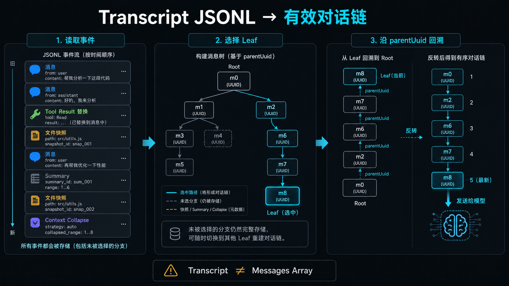
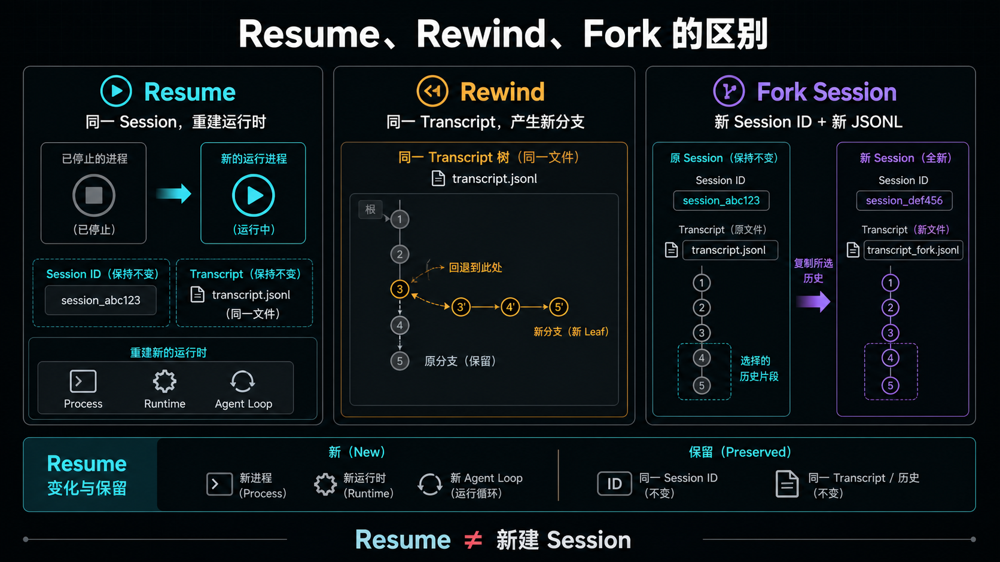
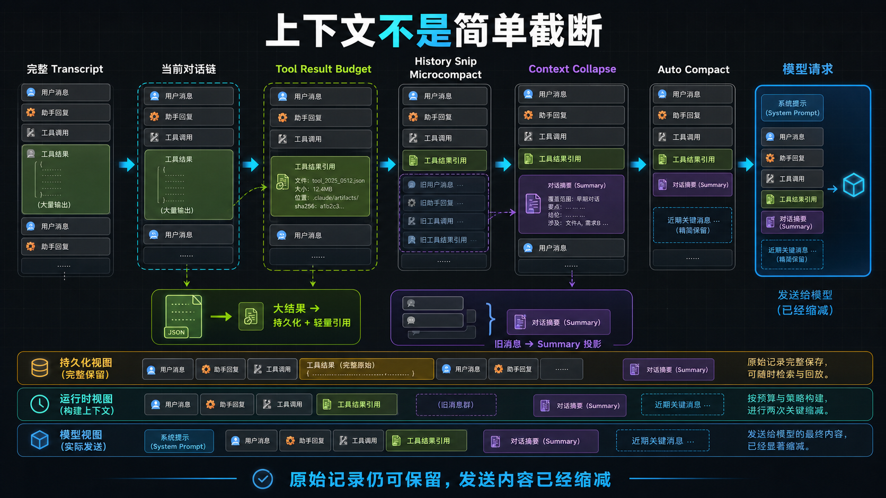
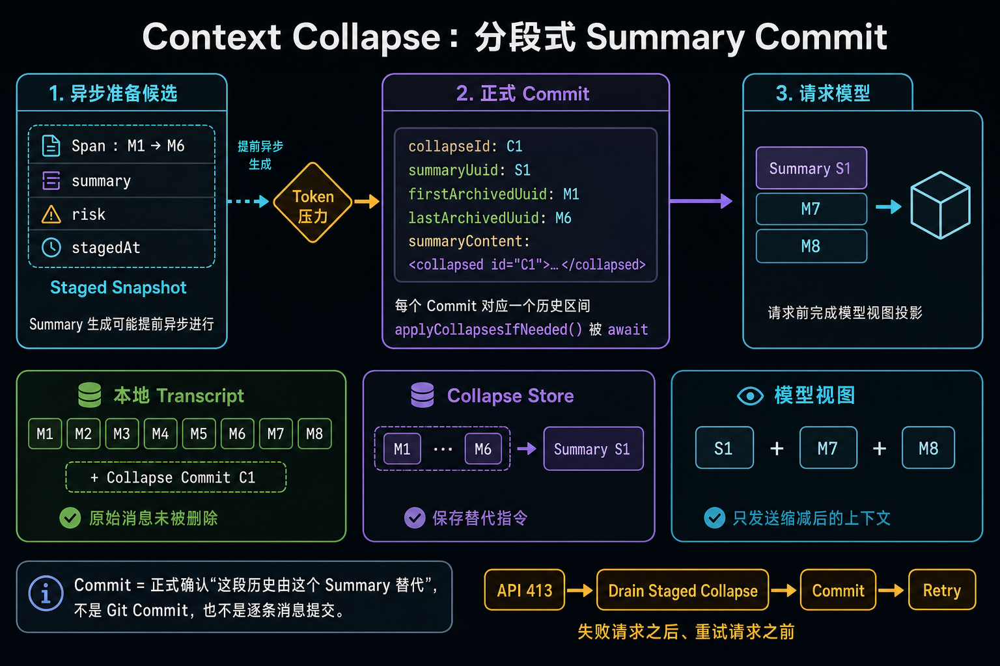

# Claude Code Implementation Study

> Evidence boundary: this study uses a local Claude Code source snapshot whose
> exact correspondence to the locally installed `2.1.224` runtime has not been
> proven. Snapshot findings are source evidence for the artifact, not confirmed
> claims about that runtime version.

## Study Goal

Build a source-backed model of how one Claude Code request becomes a sequence
of model calls, tool executions, state transitions, persisted records, and a
terminal result. Complete the Claude Code model before comparing the same
implementation slice with Codex, Pi, OpenCode, and LangGraph.

## Standard Output for Each Unit

All units follow the shared
[Agent Implementation Learning Pattern](../../LEARNING-PATTERN.md):

```text
pseudocode → abstract specification → Claude Code implementation
```

Each unit should produce:

1. one small workflow or sequence diagram;
2. the minimum essential source excerpts or code screenshots;
3. a description of the important state and data structures;
4. a separation of model decisions from deterministic runtime decisions;
5. explicit source evidence, inferences, and unresolved questions.

## Research Map

### Unit 1: Entry Delegation and Lifecycle

**Question:** How does a query enter the Agent Loop, and what does the outer
wrapper own?

- [x] Locate `query()` and `queryLoop()`.
- [x] Explain `yield*` delegation and streamed output forwarding.
- [x] Explain the role of `consumedCommandUuids`.
- [x] Explain the returned `Terminal` value.
- [x] Separate entry/cleanup responsibilities from loop orchestration.

Current note:
[Agent Loop entry and termination](./agent-loop-entry-and-termination.md)

Learner-centered record:
[Questions, provisional conclusions, and knowledge gaps](./learning-log-2026-08-07-08.md)

### Unit 2: Main Loop and Continuation Decision

**Question:** How does one effective context become a model response, an
optional tool request, and either another iteration or a terminal result?

- [x] Locate the explicit `while (true)` loop.
- [x] Identify the model-call boundary at `deps.callModel()`.
- [x] Identify streamed Assistant messages and `tool_use` blocks.
- [x] Identify tool-result collection and `state = next`.
- [x] Establish the basic continue-versus-stop model.
- [ ] Catalogue every non-tool continuation and terminal transition.

Working summary:

```text
effective context + system prompt + tool definitions
  -> streamed model response
  -> text and/or tool_use
  -> execute tools when requested
  -> append tool_result
  -> build next State or return Terminal
```

### Unit 3: Full Transcript to Effective Context

**Learning-part identity:** Part 2 — Transcript, Session Recovery, and
Effective Context.

**Question:** How does the retained conversation become the exact context sent
to the model?

This is a standalone topic, not a detail of Unit 2. It includes:

- [ ] JSONL transcript loading and conversation-chain reconstruction.
- [ ] In-memory message state and compact-boundary selection.
- [ ] Tool-result size budgeting and content replacement.
- [x] History Snip visible-source checkpoint.
- [ ] History Snip internal selection and tool protocol.
- [x] Microcompact first Pattern-based learning pass.
- [ ] Context Collapse and Auto Compact.
- [ ] System context, user context, attachments, skills, and memory injection.
- [ ] The final `messagesForQuery` and provider-request representation.
- [ ] Information retained locally but excluded or transformed for the model.
- [ ] Resume behavior after the transcript has been compacted or branched.

Required final artifact: a transformation diagram and a table comparing the
local transcript, in-memory message chain, and effective model context.

Learner-centered record:
[Part 2 questions, conclusions, cases, and visual summaries](./learning-log-2026-08-07-08.md)

Knowledge check:
[Part 2 quiz](./part-2-quiz.md)

First recorded attempt:
[Part 2 quiz attempt on 2026-08-09](./part-2-quiz-attempt-2026-08-09.md)

Part 2 is complete only when the learner can:

1. explain why a JSONL transcript is not a model-ready message array;
2. reconstruct a selected conversation branch from message identity and
   parent relationships;
3. distinguish Resume, Rewind, Fork Session, Sidechain, and parallel-tool
   persistence topology;
4. compare the retained transcript, runtime context, and model-facing request;
5. locate the source boundaries that implement each transformation; and
6. transfer the same questions to another Agent implementation without
   depending on Claude Code's symbol names.

Interface-to-implementation map:
[Agent Session and Context Interface with the current Claude Code mapping](./agent-session-context-interface-and-claude-mapping.md)

#### Visual Study Checkpoint

These diagrams capture the current working model and should be revised when
later source tracing changes any conclusion:

1. Transcript events, Leaf selection, and `parentUuid` chain reconstruction:

   

2. Resume, Rewind, and Fork Session lifecycle differences:

   

3. Tool-result replacement and the context-reduction pipeline:

   

4. Context Collapse staged Summary, span Commit, and model-view projection:

   

5. Auto Compact trigger, Compact Boundary, and post-compact message chain:

   

6. Context Collapse as a local projection over the retained transcript:

   

Source-study checkpoints:
[Context Collapse Summary, Commit, and request boundary](./context-collapse-summary-and-commit.md)

[Auto Compact trigger and context rebuild](./auto-compact-trigger-and-context-rebuild.md)

[History Snip selective removal and Resume replay](./history-snip-source-checkpoint.md)

[Microcompact tool-result payload reduction and cache editing](./microcompact-tool-result-payload-reduction.md)

Prerequisite comparison for tool-message protocol and semantic dependencies:
[Tool Message Dependencies and Context Reduction](./tool-message-dependencies-and-context-reduction.md)

#### Part 2 Source-First Study Order

The learner's remembered mechanism list is treated as a hypothesis, not as a
complete or authoritative sequence. Apply the shared learning pattern by
following the currently source-backed request path:

1. Agent State and Compact Boundary selection
2. Tool Result Budget
3. History Snip
4. Microcompact
5. Context Collapse
6. Auto Compact
7. System/User Context assembly and Provider Request
8. Overflow recovery, including Collapse Drain and Reactive Compact

This order must be revised when source tracing reveals a missing stage,
conditional branch, or more precise call boundary. A stage's position does not
imply that it transforms every request; guards and mutual suppression are
studied with the stage itself.

#### Next Study TODO (Priority 1): Context Compression and Context Collapse

**Learning status:** Context Collapse and Auto Compact have completed their
first source-backed pass. The request boundary, Collapse Commit/Snapshot
persistence, Resume replay, Auto Compact threshold guards, Compact Boundary,
and post-compact message-chain construction are understood. Reactive Compact
remains the next source slice. Exact Collapse span selection, risk scoring,
Summary generation, and projection internals remain unavailable in this local
source snapshot.

- [x] Define the terminology boundary between Tool Result Replacement, History
      Snip, Microcompact, Context Collapse, Auto Compact, and Reactive Compact.
- [ ] For each mechanism, finish recording its trigger, input, output, information loss,
      persisted evidence, retry behavior, and effect on the model-facing view.

- [ ] Trace the exact eligibility and staging rules used by
      `applyCollapsesIfNeeded()` to select a message span.
- [ ] Separate the retained Transcript, the REPL message array, the collapsed
      read-time projection, and the final `messagesForQuery` sent to the model.
- [x] Verify the ordering and interaction of Compact Boundary selection, Tool
      Result Budget, History Snip, Microcompact, Context Collapse, and Auto
      Compact.
- [x] Explain why Context Collapse runs after Microcompact and before Auto
      Compact, and when a successful collapse prevents Auto Compact.
- [ ] Trace `ContextCollapseCommitEntry` persistence and replay on `/resume`,
      including `firstArchivedUuid`, `lastArchivedUuid`, `summaryUuid`, and
      `summaryContent`.
- [ ] Trace the prompt-too-long recovery path through
      `recoverFromOverflow()`, retry, Reactive Compact, and terminal failure.
- [ ] Verify what remains available locally after a span is replaced by a
      summary in the model-facing view.
- [ ] Produce one normal pre-request collapse case and one API-overflow recovery
      case, with before-and-after message views.
- [ ] Produce a comparison diagram and retake quiz B4 after the source study.

#### Follow-up TODO: History Snip

**Learning status:** first Pattern-based learning pass completed on 2026-08-12.
The pseudocode, abstract contract, Agent Loop position, API-only message IDs,
`tokensFreed`, Snip Boundary persistence, REPL-versus-headless behavior,
Resume relinking, and tool-protocol counterexample are understood. The core
Snip modules are absent from this snapshot, so this is not the final
implementation pass.

- [ ] Locate a complete source artifact containing `snipCompact.ts`,
      `snipProjection.ts`, and `tools/SnipTool/`.
- [ ] Trace the exact SnipTool input, validation, permission, and result contract.
- [ ] Identify eligible message types, Protected Tail rules, and invalid ranges.
- [ ] Verify how multiple or overlapping removal ranges are normalized.
- [ ] Verify Tool Use / Tool Result invariants across a removed middle range.
- [ ] Compare REPL projection, Headless mutation, persisted Boundary, and Resume
      reconstruction with one concrete message-chain example.
- [ ] Trace the composition of History Snip and Microcompact in the same turn.
- [ ] Produce a visual summary and a small closed-book review.

#### Follow-up TODO: Microcompact

**Learning status:** first Pattern-based learning pass completed on 2026-08-12.
The abstract payload-reduction contract, tool protocol, Time-based path, Cached
caller path, API cache-edit projection, Provider confirmation boundary, and
information-loss tradeoff are understood. `cachedMicrocompact.ts` and the
Provider-side implementation are absent from the snapshot.

- [ ] Locate a source artifact containing `cachedMicrocompact.ts`.
- [ ] Trace thresholds, recent-result protection, `deletedRefs`, and pinned-edit
      state transitions.
- [ ] Capture a sanitized Prepared → Requested → Confirmed runtime trace.
- [ ] Verify Resume behavior after Time-based and Cached Microcompact.
- [ ] Produce a dedicated three-view comparison diagram and closed-book review.

### Unit 4: Model and Streaming Boundary

**Question:** What contract exists between the Agent Loop and the model/provider
layer?

- [ ] Trace `deps.callModel()` to the provider request.
- [ ] Map provider-neutral messages to Anthropic request fields.
- [ ] Explain streaming event normalization and partial-message handling.
- [ ] Trace model fallback, retry, API error, and token-limit recovery.
- [ ] Identify prompt-caching boundaries without conflating them with context
      selection.

#### Follow-up TODO: Cancellation Cleanup and Partial-Message Recovery

- [ ] Trace the complete idle-timeout path from the stream watchdog to
      `releaseStreamResources()`, `cleanupStream()`, stream-controller abort,
      response-body cancellation, and timer cleanup.
- [ ] Verify cleanup behavior for every generator exit path: normal stream
      completion, user abort, watchdog timeout, thrown error, consumer
      `.return()`, retry, and streaming-to-non-streaming fallback.
- [ ] Distinguish resources that are definitely released locally from remote
      inference work whose cancellation cannot be proven by client source.
- [ ] Trace how partial `stream_event` output and accumulated
      `AssistantMessage` objects are invalidated after a failed stream.
- [ ] Explain the lifecycle and consumer behavior of tombstone messages,
      including their effects on the UI and persisted transcript.
- [ ] Trace the clearing of `assistantMessages`, `toolResults`, and
      `toolUseBlocks`, and verify which objects may still be referenced by
      logging or transcript write queues.
- [ ] Trace `StreamingToolExecutor.discard()` and determine what it cancels,
      detaches, or merely stops observing.
- [ ] Identify tool side effects that cannot be rolled back after a stream is
      abandoned, and the protections against duplicate execution during
      retry or non-streaming fallback.
- [ ] Produce a cancellation sequence diagram covering watchdog timeout,
      cleanup, partial-message invalidation, fallback, and final Agent Loop
      state.

### Unit 5: Tool Definition, Permission, and Execution

**Question:** Where does model-generated intent become an external action?

- [ ] Trace tool registration and schema exposure to the model.
- [ ] Trace `tool_use` validation and tool lookup.
- [ ] Explain `StreamingToolExecutor` versus `runTools()`.
- [ ] Locate permission and approval decisions.
- [ ] Trace success, error, interruption, and partial tool results.
- [ ] Explain how `tool_result` is normalized for the next model request.

#### Follow-up TODO: Large Tool Result Persistence and Replacement

- [ ] Trace the complete timing from tool execution and full `tool_result`
      collection to the next iteration's `applyToolResultBudget()` call.
- [ ] Explain API-level user-message grouping, especially how parallel tool
      results that are separate internally may be merged on the wire.
- [ ] Trace `getPerMessageBudgetLimit()`, tool-specific exclusions, dynamic
      overrides, and the current-snapshot default aggregate limit without
      treating it as a stable public contract.
- [ ] Explain how `selectFreshToReplace()` chooses results until a message is
      under budget, including mixed large and small parallel results.
- [ ] Trace `persistToolResult()`, `buildLargeToolResultMessage()`,
      `replaceToolResultContents()`, and failure behavior when persistence does
      not succeed.
- [ ] Trace `toolUseId -> replacement` persistence in the Transcript and exact
      reconstruction and reapplication behavior after `/resume`.
- [ ] Distinguish the full local tool output, the Transcript replacement
      record, the in-memory replacement map, and the content actually sent to
      the model.
- [ ] Define cleanup, privacy, integrity, and replay requirements for persisted
      tool outputs.
- [ ] Produce a multi-tool case whose aggregate result crosses the budget and
      show the before-and-after API message.

#### Follow-up TODO: Parallel Tool Serialization and Chain Recovery

- [ ] Trace one model response containing multiple `tool_use` blocks from raw
      streaming events through the emitted `AssistantMessage` objects.
- [ ] Explain why sibling Assistant blocks can have distinct message UUIDs but
      share the same provider `message.id`.
- [ ] Trace how `sourceToolAssistantUUID`, `parentUuid`, `tool_use.id`, and
      `tool_result.tool_use_id` create the persisted topology for parallel
      calls.
- [ ] Distinguish semantic conversation branching from the technical branches
      produced by per-content-block streaming and persistence.
- [ ] Verify when a plain single-parent leaf walk omits sibling Assistant blocks
      or their Tool Results.
- [ ] Trace `recoverOrphanedParallelToolResults()` grouping, ordering, insertion,
      deduplication, and malformed or missing-result behavior.
- [ ] Explain how recovered siblings and Tool Results are normalized back into
      one API-level Assistant/User turn.
- [ ] Test interruption, retry, fallback, and `/resume` with two or more
      parallel tools so results never attach to the wrong attempt or Tool Use.
- [ ] Produce a diagram showing persisted graph topology versus the semantic
      model message reconstructed from it.

#### Design Discussion TODO: Tool-Execution Contract

Treat tool execution as a major design topic rather than only an implementation
detail. Start from the provisional boundary: the model proposes a tool call from
the schemas exposed to it, while the runtime retains authority to validate,
authorize, schedule, execute, and report the result.

- [ ] Decide which tools are exposed to the model for each turn and how the
      list is refreshed or reduced.
- [ ] Evaluate how tool names, descriptions, and input schemas influence model
      selection and argument quality.
- [ ] Separate model choice, deterministic validation, permission approval,
      and actual execution in the architecture.
- [ ] Design validation for unknown tools, malformed arguments, stale schemas,
      and tool calls that become unavailable after generation.
- [ ] Compare sequential, parallel, and streaming execution, including ordering
      and dependency rules for multiple tool calls.
- [ ] Define cancellation, timeout, retry, idempotency, and compensation
      semantics for tools with external side effects.
- [ ] Define the `tool_result` contract for success, partial progress, errors,
      denial, interruption, and oversized output.
- [ ] Identify observability requirements: tool-use IDs, attempt ownership,
      timing, permission decisions, result provenance, and replay safety.
- [ ] Compare how Claude Code, Codex, Pi, OpenCode, and LangGraph place these
      boundaries before proposing a reusable design.

### Unit 6: State, Persistence, and Resume

**Question:** Which state exists only during a turn, and which state survives a
process or session boundary?

- [ ] Map `State`, message UUIDs, parent UUIDs, session IDs, tool-use IDs, and
      Agent IDs.
- [ ] Trace transcript writes and JSONL entry types.
- [ ] Explain resume, rewind, branching, sidechains, and session reconstruction.
- [ ] Identify large tool-result and artifact storage boundaries.
- [ ] Separate local persistence from data sent to remote model services.

### Unit 7: Control, Hooks, and Recovery

**Question:** Which deterministic mechanisms can override or extend the model's
apparent completion decision?

- [ ] Stop Hooks and tool-related Hooks.
- [ ] Abort during streaming versus abort during tool execution.
- [ ] Maximum turns and token-budget continuation.
- [ ] Context overflow and output-token recovery.
- [ ] Queued commands, background notifications, and follow-up input.
- [ ] Crash and interrupted-tool recovery boundaries.

### Unit 8: Subagents and Concurrency

**Question:** How are additional agents and concurrent work represented and
joined?

- [ ] Forked and background Agent entry points.
- [ ] Sidechain transcript ownership.
- [ ] Parallel or streaming tool execution.
- [ ] Agent-scoped queues, notifications, cancellation, and result delivery.

### Unit 9: Extension and Observability Surfaces

**Question:** What can external users extend or inspect safely?

- [ ] Skills, Hooks, commands, plugins, MCP, and Agent definitions.
- [ ] Logs, checkpoints, transcript evidence, and telemetry.
- [ ] Public contracts versus internal version-sensitive seams.
- [ ] Tests or bounded runtime observations that can verify source inferences.

### Unit 10: Same-Slice Comparison

Compare Claude Code with Codex, Pi, OpenCode, and LangGraph only after the same
unit is complete for each system. Compare implementation layers rather than
product feature lists.

Initial comparison axes:

- loop ownership and state representation;
- model request and streaming contract;
- continuation and terminal decisions;
- context transformation and persistence;
- tool dispatch and permission boundary;
- recovery, concurrency, and extension surfaces.

## Current Position

Units 1 and the basic path of Unit 2 are understood. Unit 3 is in progress:
Transcript reconstruction and session recovery are mapped; Context Collapse
and Auto Compact have completed a first source-backed pass; and History Snip
and Microcompact have completed their first Pattern-based learning passes.
The next bounded slice is the deeper Context Collapse pass, followed by the
remaining Auto/Reactive Compact and runtime-verification work recorded above.
