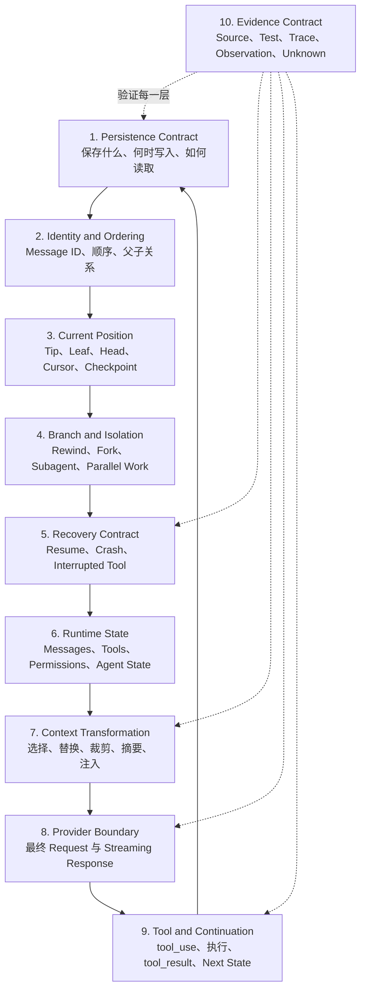
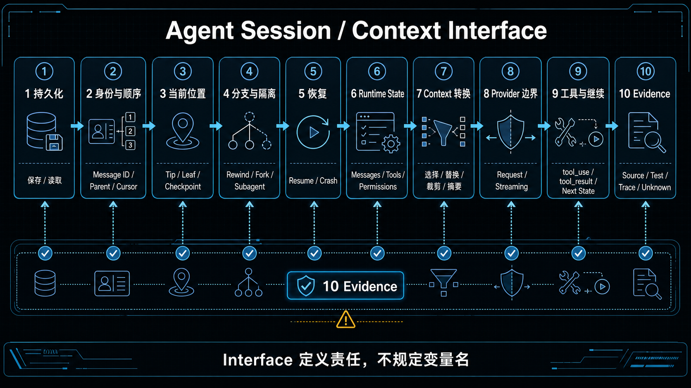
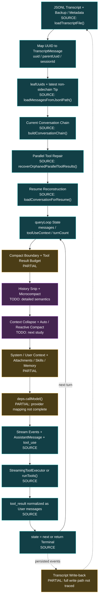
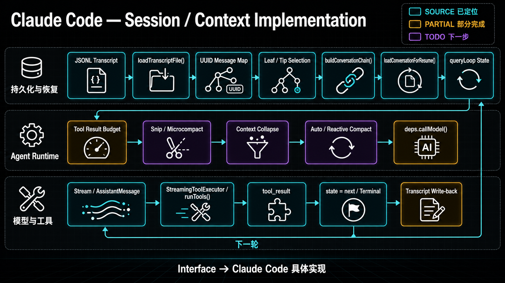

# Agent Session and Context Interface, with a Claude Code Mapping

> 研究对象：通用 Coding Agent 调查接口，以及本地 Claude Code 源码快照中的当前映射。
> 证据边界：该源码快照尚未被证明与本机 Claude Code `2.1.224` 完全对应。
> 本文中的 `SOURCE`、`PARTIAL` 和 `TODO` 表示当前研究成熟度，不表示产品能力评级。

## 为什么需要两层设计

跨 Agent 对比不能依赖某个实现的变量名。Claude Code 使用 JSONL、`uuid`、
`parentUuid` 和 `queryLoop()`，其他实现可能使用数组、数据库、事件流、Cursor 或状态机。

因此研究模型分为两层：

```text
Interface
  定义每个 Agent 必须承担的系统责任和需要回答的问题

Implementation
  说明某个具体 Agent 用哪些数据结构、函数和控制流承担这些责任
```

## 图一：通用 Agent Session / Context Interface





这个 Interface 可以压缩成一组与实现无关的操作：

```ts
interface AgentSessionContextContract {
  persist(event: RuntimeEvent): Promise<PersistentRef>
  restore(session: SessionRef, cursor?: Cursor): Promise<RuntimeState>
  selectCurrentBranch(history: PersistedHistory): ConversationView
  buildEffectiveContext(state: RuntimeState): EffectiveContext
  callModel(context: EffectiveContext): AsyncIterable<ModelEvent>
  applyModelEvent(event: ModelEvent): RuntimeUpdate
  executeTools(requests: ToolRequest[]): AsyncIterable<ToolUpdate>
  decideNext(state: RuntimeState): NextState | Terminal
}
```

这不是要求每个项目真的声明同名 TypeScript Interface。它是一份研究契约：即使实现使用
Rust、Python、数据库或 Actor Model，也应能回答这些责任落在哪里。

## Interface 的调查问题

| Interface 层 | 必须回答的问题 |
|---|---|
| Persistence | 持久化单位是什么？何时写入？是否追加写入？原始内容保留多久？ |
| Identity | Message、Turn、Request、Tool Call、Session 分别如何标识和关联？ |
| Current Position | 当前从哪条消息或哪个 Checkpoint 继续？如何排除旧分支和 Sidechain？ |
| Branch | Rewind、Fork、Subagent 和并行工具是否共享同一拓扑？ |
| Recovery | Resume 如何重建状态？未完成工具、部分响应和损坏记录如何处理？ |
| Runtime State | 哪些状态只存在于本轮？哪些跨 Turn、Session 或进程保留？ |
| Context | 完整历史如何变成模型输入？每一步删除、替换、总结或注入什么？ |
| Provider | 最终请求字段是什么？流式事件如何转成稳定语义消息？ |
| Tool / Continue | 模型意图如何被验证、授权、执行，并决定下一轮或终止？ |
| Evidence | 哪些是源码事实、测试事实、运行观察、推断或未知？ |

## 图二：Claude Code 当前实现映射





## 已经可以填入 Claude Code 实现的问题

### 1. Persistence Contract — `SOURCE`，但写回链仍为 `PARTIAL`

当前已经知道：

- Session 记录采用 JSONL Transcript；
- `loadTranscriptFile()` 读取 Message 和多类辅助事件；
- File History Backup 的实际文件内容与 JSONL 元数据分开保存；
- Summary、Attribution Snapshot、Content Replacement 和 Context Collapse Commit
  具有不同持久化职责；
- 大型 Transcript 的预边界读取优化改变内存加载范围，不等于直接改写原文件。

尚未完成：所有 Transcript Entry 的写入入口、Flush 时机、异常写入和 Crash 一致性。

### 2. Identity and Ordering — `SOURCE`

当前已确认的身份层包括：

```text
sessionId
  -> 会话身份

uuid / parentUuid
  -> Transcript Message 身份和父子拓扑

Provider message.id
  -> 同一次模型响应的 Provider 身份

tool_use.id / tool_result.tool_use_id
  -> 具体 Tool Call 与 Result 的关联

Agent ID / isSidechain
  -> Main Agent 与 Subagent 执行范围
```

### 3. Current Position and Branch Selection — `SOURCE`

- `loadTranscriptFile()` 计算 `leafUuids`；
- JSONL 路径恢复排除 `isSidechain`，再选择最新有效 Leaf；
- `buildConversationChain()` 从 Leaf 沿 `parentUuid` 回溯，再反转为正序；
- 普通单父节点回溯后，还会修复并行工具产生的兄弟 Assistant Block 和 Tool Result。

### 4. Branch and Isolation — `SOURCE / PARTIAL`

已经能区分：

| 机制 | Claude Code 当前映射 |
|---|---|
| Resume | 同一 Session 和 Transcript，重建新的运行时状态 |
| Rewind | 同一 Transcript 中从旧节点形成新的语义分支 |
| Fork Session | 新 Session ID 和新 Transcript，从选中历史继续 |
| Subagent | `agentId` / `isSidechain` 隔离的执行链 |
| Parallel Tool | 同一语义响应在持久化拓扑中的技术分叉 |

尚未完成：所有异常情况下的 Branch Selection、重复记录、断链和相同时间排序。

### 5. Recovery Contract — `SOURCE / PARTIAL`

`loadConversationForResume()` 当前已知会：

- 选择 Resume 来源；
- 加载并恢复当前消息链；
- 恢复 Skill State；
- 反序列化消息并检测未解决的 Tool Use；
- 注入 Session Start Hook；
- 恢复 File History、Attribution、Content Replacement 和 Context Collapse 状态。

尚未完成：Crash、部分写入、缺失 Tool Result 和所有中断恢复路径的运行验证。

### 6. Runtime State — `SOURCE`

`queryLoop()` 使用显式 `while (true)` 和可替换的 `State`：

```text
messages
toolUseContext
turnCount
compact / recovery tracking
pending tool summary
stop-hook state
transition reason
```

模型产生工具请求后，Runtime 执行工具、收集 `tool_result`，构建新 State，并通过
`state = next` 进入下一轮。

### 7. Context Transformation — `PARTIAL / NEXT TODO`

目前只确认高层顺序：

```text
Compact Boundary
→ Tool Result Budget
→ History Snip
→ Microcompact
→ Context Collapse
→ Auto Compact
→ Context / Attachment Injection
→ deps.callModel()
```

还不能宣称已经掌握每种机制的触发条件、信息损失、State 变化、Prompt Cache 影响、
Commit 持久化和 Overflow Recovery。它是下一学习优先级。

### 8. Provider Boundary — `PARTIAL`

已经定位 `deps.callModel()`，并确认模型响应以流式事件进入 Agent Loop；但从内部消息到
Anthropic Provider Request 的完整字段映射、Prompt Cache 边界和所有 Fallback 尚属于
Unit 4。

### 9. Tool and Continuation — `SOURCE / PARTIAL`

已经确认基本路径：

```text
Assistant tool_use
→ StreamingToolExecutor 或 runTools()
→ tool_result
→ normalizeMessagesForAPI()
→ 下一 State 或 Terminal
```

尚未完成：完整 Tool Definition、Permission、Validation、Idempotency 和 Compensation
Contract，它们保留在 Unit 5。

## 当前覆盖矩阵

| Interface 层 | Claude Code 当前状态 | 下一证据 |
|---|---|---|
| Persistence read | SOURCE | 补 Transcript write path |
| Identity / ordering | SOURCE | 异常和重复记录测试 |
| Tip / Leaf selection | SOURCE | 损坏链和相同时间 Case |
| Branch / isolation | SOURCE / PARTIAL | Rewind、Fork、Sidechain Runtime Trace |
| Resume recovery | SOURCE / PARTIAL | 中断、缺失结果和 Crash Case |
| Runtime State | SOURCE | 状态字段生命周期表 |
| Context transformation | PARTIAL / TODO | 下一学习单元 |
| Provider boundary | PARTIAL | Unit 4 |
| Tool execution | SOURCE / PARTIAL | Unit 5 |
| Write-back consistency | TODO | Transcript 写入链与 Trace |

## 如何用于后续 Agent 对比

研究 Codex、Pi、OpenCode 和 LangGraph 时，复制“当前覆盖矩阵”，逐层填入它们自己的
实现符号。比较时应问：

```text
同一个 Interface 责任由谁拥有？
使用什么状态和持久化结构？
正常路径和异常路径如何不同？
哪些结论已有 Source / Test / Trace 支持？
```

不要问“它有没有 `parentUuid`”，而要问“它如何表示消息顺序、当前位置和分支”。这
使不同语言、数据结构和产品架构仍能进行同切面对比。
