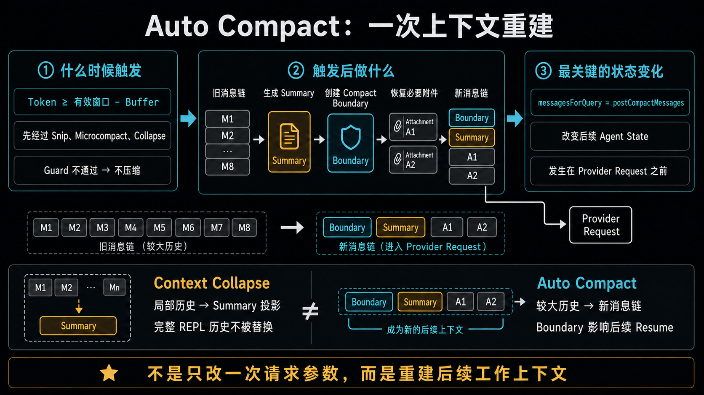
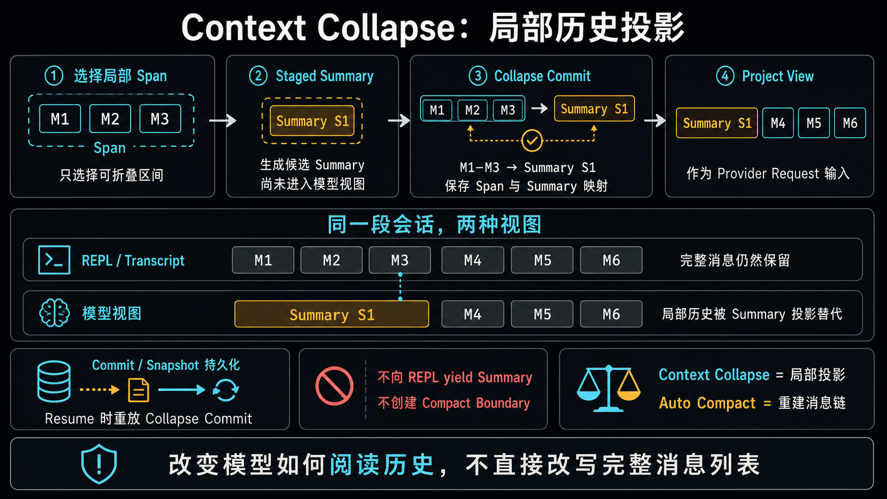

# Auto Compact：触发判断与上下文重建

> 研究对象：本地 Claude Code 源码快照
> 版本边界：该快照尚未被证明与本机 Claude Code `2.1.224` 完全对应。
> 本文只记录当前快照能够直接证明的实现，并把内部配置值视为实现细节，而不是稳定产品契约。

## 核心结论

Auto Compact 是一次发生在 Provider Request 之前的、Token 阈值驱动的消息链重建：

```text
当前 messages
→ 判断是否需要 Auto Compact
→ 生成整体 Summary
→ 创建 Compact Boundary
→ 恢复必要附件与 Hook 结果
→ buildPostCompactMessages()
→ messagesForQuery = postCompactMessages
→ Provider Request
```

它不只是临时调整某一次请求的参数。生成的新消息会被 `queryLoop()` yield，并成为后续
Agent Loop 继续追加 Assistant Message、Tool Result 和 Attachment 的基础状态。

## 请求前的位置

`src/query.ts` 的当前顺序是：

```text
Compact Boundary selection
→ Tool Result Budget
→ History Snip
→ Microcompact
→ Context Collapse projection
→ Auto Compact
→ Provider Request
```

调用点执行：

```ts
const { compactionResult, consecutiveFailures } =
  await deps.autocompact(
    messagesForQuery,
    toolUseContext,
    {
      systemPrompt,
      userContext,
      systemContext,
      toolUseContext,
      forkContextMessages: messagesForQuery,
    },
    querySource,
    tracking,
    snipTokensFreed,
  )
```

调用 `deps.autocompact()` 不等于一定发生压缩。真正的触发判断位于
`src/services/compact/autoCompact.ts` 的 `shouldAutoCompact()`。

## Token 触发条件

当前快照中的默认阈值公式是：

```text
Auto Compact Threshold
= Effective Context Window - AUTOCOMPACT_BUFFER_TOKENS
```

其中 `AUTOCOMPACT_BUFFER_TOKENS` 当前为 `13_000`。例如有效窗口是 200K 时，默认
阈值约为 187K。这个数值可能随版本、模型或配置变化，不能当作公开稳定契约。

实际检查使用：

```ts
const tokenCount =
  tokenCountWithEstimation(messages) - snipTokensFreed
```

减去 `snipTokensFreed` 是为了校正 History Snip 已经释放、但旧 Assistant usage 仍可能
包含的 Token。否则 Auto Compact 可能被 Snip 之前的旧 usage 错误触发。

## `shouldAutoCompact()` 的 Guard

Token 超过阈值只是必要条件，不是充分条件。当前可见 Guard 包括：

1. `querySource` 是 `session_memory` 或 `compact` 时返回 `false`，避免递归 Compact；
2. Auto Compact 功能关闭时返回 `false`；
3. Reactive-only 实验模式下不进行主动 Compact；
4. Context Collapse 开启时返回 `false`，由 Collapse 接管主动上下文管理；
5. 只有校正后的 Token Count 达到阈值，才返回 `true`。

因此：

```text
deps.autocompact() 被调用
≠ Auto Compact 被执行
```

## `autoCompactIfNeeded()` 的执行路径

`src/services/compact/autoCompact.ts` 的 `autoCompactIfNeeded()` 负责：

```text
检查 DISABLE_COMPACT
→ 检查连续失败熔断
→ shouldAutoCompact()
→ 优先尝试 Session Memory Compaction
→ 不可用时调用 compactConversation()
→ 返回 CompactionResult
```

连续失败次数最多累积到 3。达到上限后，当前链路不再每轮重复发起 Compact，避免反复
失败和额外模型消耗。

Session Memory Compact 是一个优先分支：如果已经存在合格的 Session Memory，它可以
直接把长期记忆作为 Summary，并保留一部分近期原始消息；不满足条件时才回退到传统
`compactConversation()`。

## Summary 生成

传统路径先构造 Compact Prompt：

```ts
const compactPrompt = getCompactPrompt(customInstructions)
const summaryRequest = createUserMessage({ content: compactPrompt })
```

随后通过 `streamCompactSummary()` 对传入的较大消息链发起独立 Summary 请求。如果
Compact 请求本身也触发 Prompt Too Long，代码会按 API Round 从头部截去较旧消息后
重试，而不是让用户永久卡在无法压缩的状态。

最终 Summary 被包装成特殊的 `UserMessage`：

```ts
createUserMessage({
  content: getCompactUserSummaryMessage(...),
  isCompactSummary: true,
  isVisibleInTranscriptOnly: true,
})
```

它告诉下一次模型：这是先前会话的压缩表示，应从中断处直接继续；需要精确旧代码或
错误信息时，可以读取完整 Transcript。

## `CompactionResult`

当前结构包含：

```ts
interface CompactionResult {
  boundaryMarker: SystemMessage
  summaryMessages: UserMessage[]
  attachments: AttachmentMessage[]
  hookResults: HookResultMessage[]
  messagesToKeep?: Message[]
  userDisplayMessage?: string
  preCompactTokenCount?: number
  postCompactTokenCount?: number
  truePostCompactTokenCount?: number
  compactionUsage?: ReturnType<typeof getTokenUsage>
}
```

Summary 只是新上下文的一部分。Claude Code 还需要恢复近期消息、文件、Plan Mode、已
调用 Skill、Deferred Tools、MCP Instructions 和 Session Hooks 等继续执行任务所需的
上下文。

## 新消息链的顺序

`buildPostCompactMessages()` 明确构造：

```ts
return [
  result.boundaryMarker,
  ...result.summaryMessages,
  ...(result.messagesToKeep ?? []),
  ...result.attachments,
  ...result.hookResults,
]
```

正确顺序是：

```text
Compact Boundary
→ Summary
→ 可选的近期原始消息
→ Attachments
→ Hook Results
```

`queryLoop()` 随后执行：

```ts
const postCompactMessages = buildPostCompactMessages(compactionResult)

for (const message of postCompactMessages) {
  yield message
}

messagesForQuery = postCompactMessages
```

这同时证明：

1. 新消息被 yield 到外层消息流；
2. 当前 Provider Request 使用新消息链；
3. 后续 Agent State 继续基于新消息链演进。

## Transcript 与 Resume

Auto Compact 不应被理解为立即物理删除整个旧 Transcript。更准确的模型是：

```text
持久化 Transcript
├── Compact 前的原始历史
├── 新增 Compact Boundary
├── 新增 Compact Summary 和恢复消息
└── Compact 后的新交互
```

恢复和构造有效上下文时，`getMessagesAfterCompactBoundary()` 从最近的 Compact Boundary
之后选择工作消息。因此旧历史仍可用于审计或精确查阅，但 Boundary 后的新消息链成为
模型继续工作的主要上下文。

## 与 Context Collapse 的区别

| 维度 | Context Collapse | Auto Compact |
|---|---|---|
| 核心动作 | 局部历史投影 | 重建后续消息链 |
| 处理范围 | 一个或多个局部 Span | 较大的当前历史 |
| Summary | 可有多个 Collapse Summary | 通常是一个整体 Compact Summary |
| REPL yield | 不向 REPL yield Summary | yield Boundary、Summary 和恢复消息 |
| Compact Boundary | 不创建 | 创建 |
| Agent State | 主要改变可重放的模型视图 | 明确替换后续工作消息链 |
| Resume | 重放 Collapse Commit | 从最近 Compact Boundary 后构造上下文 |

当前快照中，Context Collapse 开启会抑制主动 Auto Compact。真实 API 请求仍然过长时，
恢复顺序是先 Drain 已有 Staged Collapse；仍失败后才可能进入 Reactive Compact。

## 视觉总结



配套的 Context Collapse 图：



详细的 Collapse 源码记录：
[Context Collapse：Summary、Commit 与请求边界](./context-collapse-summary-and-commit.md)

## 当前证据矩阵

| 问题 | 状态 |
|---|---|
| Auto Compact 在 Provider Request 前运行 | `SOURCE` |
| 默认阈值公式与当前 13K Buffer | `SOURCE` |
| Token Count 会减去 Snip 释放量 | `SOURCE` |
| Guard 与 Context Collapse 抑制关系 | `SOURCE` |
| Session Memory 优先、传统 Compact 回退 | `SOURCE` |
| `CompactionResult` 与新消息链顺序 | `SOURCE` |
| 新消息被 yield 并替换 `messagesForQuery` | `SOURCE` |
| Compact Boundary 影响后续 Resume 上下文 | `SOURCE` |
| 当前源码快照是否等于安装版 `2.1.224` | `UNKNOWN` |
| 内部配置值是否会在其他版本保持一致 | `UNKNOWN` |

## 下一学习切片

下一轮先对 Auto Compact 做一次更小的源码复习，再进入 Reactive Compact：

1. 闭卷重画 `shouldAutoCompact()` 的 Guard Tree；
2. 用一个 200K Context Window 案例计算触发结果；
3. 对照源码复述 `CompactionResult` 和新消息链顺序；
4. 追踪真实 Prompt Too Long 如何进入 `tryReactiveCompact()`；
5. 完成 Context Collapse、Auto Compact、Reactive Compact 的最终时序表。
