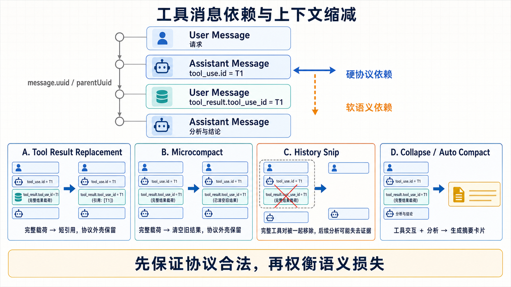

# Microcompact：工具结果 Payload 缩减与缓存编辑

> 学习日期：2026-08-12
> 研究对象：本地 Claude Code 源码快照
> 版本边界：该快照尚未被证明与本机 Claude Code `2.1.224` 完全对应。
> 实现边界：`microCompact.ts`、Time-based 路径、调用方和 API 请求投影可见；
> 动态导入的 `cachedMicrocompact.ts` 与 Provider 服务端 Cache Editing 实现不在当前
> 快照中。缺失部分继续标记为 `UNKNOWN`。

## 0. 研究问题

Microcompact 如何在不破坏 `tool_use` / `tool_result` 协议的前提下，降低旧工具结果在
模型有效上下文中的成本？本地消息、Provider 请求和缓存视图分别发生什么变化？

配套基础比较：
[Tool Message Dependencies and Context Reduction](./tool-message-dependencies-and-context-reduction.md)

## 1. 伪代码

```text
function reduce_old_tool_results(messages, policy, provider_capabilities):
    if trigger_not_reached(messages, policy):
        return Unchanged(messages)

    compactable_ids = find_compactable_tool_uses(messages)
    protected_ids = keep_recent_or_required(compactable_ids)
    ids_to_reduce = compactable_ids - protected_ids

    if ids_to_reduce is empty:
        return Unchanged(messages)

    if provider_capabilities supports cache editing:
        return ProviderEditPrepared {
            messages: unchanged,
            cache_edits: delete(ids_to_reduce)
        }

    return ContentReduced {
        messages: replace_matching_tool_result_payloads(
            messages,
            ids_to_reduce,
            "[Old tool result content cleared]"
        )
    }
```

Microcompact 不总结整个会话，也不删除完整工具交换。它保留：

```text
Assistant tool_use.id
        ⇅
User tool_result.tool_use_id
```

主要缩减 `tool_result.content`。

## 2. 抽象规范

通用接口可命名为 `ToolResultPayloadReduction`：

```text
ToolResultPayloadReduction.apply({
  messages,
  eligibleTools,
  triggerPolicy,
  retentionPolicy,
  providerCapabilities,
  reductionState
}) ->
    Unchanged { messages }
  | ContentReduced { messages, reducedToolIds, tokensSaved }
  | ProviderEditPrepared { messages, providerEdits, reducedToolIds }
```

### 职责与非职责

它负责：

- 识别可缩减的旧工具结果；
- 保护最近或仍在使用的 Working Set；
- 保持工具调用协议外壳；
- 降低当前模型视图或 Provider 缓存视图的成本。

它不负责：

- 判断整段对话是否应删除；
- 为旧历史生成 Summary；
- 创建新的 Compact Boundary 和完整 Post-Compact Message Chain；
- 回滚工具副作用；
- 保证被清理的原始结果可从占位文本恢复。

### 核心不变量

1. `tool_use.id` 与 `tool_result.tool_use_id` 必须继续匹配。
2. Assistant / User 的 Provider Role 顺序不能被破坏。
3. 占位内容必须表达“结果曾返回但原文已不可见”，不能伪装成真实结果。
4. 最近 Working Set 或策略保护范围不能同时进入清理集合。
5. 相同消息、策略和状态应产生确定的候选集合。
6. 本地消息不变时，Provider 编辑必须在后续请求中稳定重放。
7. “模型不可见”不能被误写为“Transcript 原始证据已物理销毁”。

### 信息政策

| 信息 | 默认结果 |
|---|---:|
| 工具曾被调用 | 保留 |
| 工具名称和输入 | 保留 |
| 工具已返回结果 | 保留 |
| Tool Use / Result 配对 | 保留 |
| 原始 Result Payload | 从当前模型视图缩减 |
| 后续 Assistant 分析 | 保留 |
| 原始 Payload 可精确重建 | 不保证 |

## 3. Claude Code 实现

### 请求管线位置

```text
Tool Result Budget
→ History Snip
→ Microcompact
→ Context Collapse
→ Auto Compact
→ Provider Request
```

`queryLoop()` 调用 `microcompactMessages(messagesForQuery, toolUseContext,
querySource)`，然后用返回的 `messages` 更新 `messagesForQuery`。Cached 路径还会返回
`pendingCacheEdits`，其 Boundary 延迟到 Provider 响应后产生。

### 候选发现

`collectCompactableToolIds()` 先扫描 Assistant Message：

```ts
if (block.type === 'tool_use' && COMPACTABLE_TOOLS.has(block.name)) {
  ids.push(block.id)
}
```

再以这些 ID 匹配 User Message 中：

```text
tool_result.tool_use_id
```

因此工具名称决定资格，Tool Use ID 建立调用和结果之间的硬协议关系。

### 总入口的分支顺序

```text
microcompactMessages()
├── Time-based 触发成功 → 直接返回缩减后的 messages
├── Cached 路径可用     → 返回 messages + pendingCacheEdits
└── 两者都不可用        → 返回原 messages
```

Time-based 优先，因为时间间隔超过阈值意味着 Prompt Cache 很可能已经冷却；此时直接
重写 Payload 比维护旧缓存引用更合适。

### Time-based Microcompact

触发条件包括：

- 功能开启；
- 明确的 Main Thread `querySource`；
- 存在先前 Assistant Message；
- 距上次 Assistant Message 超过配置阈值。

它至少保护最近一个候选：

```ts
const keepRecent = Math.max(1, config.keepRecent)
```

旧结果正文被替换为：

```text
[Old tool result content cleared]
```

`tool_result` Block 和 `tool_use_id` 保持不变。因此变化发生在当前运行时请求消息和
模型视图，而不是已证明的 JSONL 物理覆写。

### Cached Microcompact

Cached 路径：

```text
登记可压缩 Tool Result
→ 选择 toolsToDelete
→ 创建 cache_edits
→ 返回原 messages
→ API 层添加 cache_reference 并插入 cache_edits
→ Provider 返回实际 cache_deleted_input_tokens
```

概念请求：

```text
tool_result {
  tool_use_id: T1,
  cache_reference: T1,
  content: <本地仍完整>
}

cache_edits {
  delete cache_reference: T1
}
```

API 层会 Pin 已插入的编辑并在后续请求重放。`messages` 不变只能说明本地消息未改写，
不能说明 Provider 请求视图没有发生变化。

### 成功确认与 Boundary

Cached 路径请求前只能记录 `baselineCacheDeletedTokens`。Provider 响应后计算：

```text
本轮实际删除量
= 当前累计 cache_deleted_input_tokens
- 请求前 baseline
```

只有差值大于零时才产生 `microcompact_boundary`。因此必须分开：

```text
Prepared  → 已生成 Cache Edit
Requested → 已放入 Provider Request
Confirmed → Provider Usage 报告实际删除量
```

Boundary 证明 Confirmed，不只是 Prepared。

### 两条路径的视图差异

| 视图 | Time-based | Cached |
|---|---|---|
| Transcript JSONL | 未证明被物理覆写 | 不变 |
| 当前 Runtime Messages | Result Payload 被替换 | 不变 |
| API Request | 发送替换后的 Payload | 添加引用和编辑指令 |
| Provider Cache View | 新内容重新形成缓存 | 按引用编辑既有缓存 |
| Boundary | 可由客户端转换结果表达 | 等 Provider Usage 后产生 |
| 跨进程状态 | 未完整验证 | 注释说明无磁盘持久化 |

## 4. Worked Example

```text
A1 tool_use(Read, T1)
U2 tool_result(T1, 80K)
A2 "发现配置错误"

A3 tool_use(Grep, T2)
U4 tool_result(T2, 50K)
A4 "找到三个调用点"

A5 tool_use(Read, T3)
U6 tool_result(T3, 30K)
```

保留最近一个候选时：

```text
T1 → 清理
T2 → 清理
T3 → 完整保留
```

所有 `tool_use`、所有 `tool_result` 外壳以及 `A2`、`A4` 都保留。被清理的是
`U2`、`U4` 中的原始 Payload，而不是完整消息。

## 5. 边界与反例

### 协议安全不等于语义安全

保留占位符可以维持 Provider 协议，但后续 Assistant 的概括可能不足以替代完整证据。
模型知道工具执行过，却无法重新检查原始输出。

### 副作用工具

Migration、交易或不可重复 Shell 输出不能只按字符大小判断。清理结果不会回滚工具
副作用，反而可能让模型失去成功、失败或部分完成的审计证据。

### 并行工具

一条 User Message 可以同时包含多个 Tool Result。实现必须按 Block 处理：

```text
U1:
├── T1 → cleared
├── T2 → cleared
└── T3 → retained
```

不能因为其中两个结果符合条件就删除整条 User Message。

### Time-based 与 Cached 状态切换

Time-based 直接改变 Prompt 内容后，旧 Provider Cache 引用可能失效，因此实现会重置
Cached Microcompact State，防止后续请求对新缓存使用过期引用。

## 6. 视觉总结

当前复用工具依赖比较图：



后续第二轮可补一张专门对比 Time-based 与 Cached 三视图差异的图。

## 7. 证据账本

| 结论 | 状态 |
|---|---|
| Microcompact 位于 History Snip 后、Context Collapse 前 | `SOURCE` |
| 候选资格从 Assistant `tool_use.name` 开始判断 | `SOURCE` |
| Result 通过 `tool_use_id` 与候选匹配 | `SOURCE` |
| Time-based 至少保留最近一个候选 | `SOURCE` |
| Time-based 替换 `tool_result.content` | `SOURCE` |
| Cached 路径返回原 messages 和 Pending Edit 信息 | `SOURCE` |
| API 层插入 `cache_reference` / `cache_edits` 并 Pin | `SOURCE` |
| Boundary 等 Provider Usage 确认实际删除量 | `SOURCE` |
| Cached State 无磁盘持久化 | `SOURCE`（源码注释） |
| `cachedMicrocompact.ts` 的阈值和状态转移算法 | `UNKNOWN` |
| Provider 服务端如何执行 Cache Editing | `UNKNOWN` |
| 当前快照是否等于安装版 `2.1.224` | `UNKNOWN` |

## 8. 第一阶段学习成果

### 原始理解与校准

本轮形成并校准了以下理解：

- 能正确判断“保留最近一个”案例中 `T1/T2` 的 Result Payload 被清理、`T3`
  完整保留。
- 从“保留 U6”校准为：所有 Assistant `tool_use` 和 User `tool_result` 外壳都保留，
  只有最近的 `U6.content` 完整保留。
- 从“Cached messages 没变就是没有发生”校准为：它可能已 Prepared 或 Requested，
  是否 Confirmed 必须看 Provider Usage。
- 从“Time-based 修改 Transcript”校准为：它修改当前 Runtime / Model-facing
  Message View，未证明物理改写 JSONL。
- 从“清理造成不可逆副作用”校准为：清理直接造成的是模型证据可见性下降，不是工具
  副作用回滚；原始证据是否仍可恢复必须逐层判断。

### 校准后的 Teach-back

> Microcompact 局部清理已经过旧或成本过高的 Tool Result Payload，同时保留工具协议
> 骨架与近期 Working Set；它不像 Auto Compact 那样总结并重建整个上下文。
> Time-based 路径直接改变当前运行时和模型请求中的结果内容，Cached 路径保持本地
> 消息不变，通过 Cache Edits 改变 Provider 缓存视图。它最大的风险是错误清理仍被
> 后续推理依赖的原始证据，使模型无法复查结果，尤其难以重新获得副作用或不可重放
> 工具的历史输出。

### 掌握状态

| 学习环节 | 状态 | 说明 |
|---|---|---|
| 伪代码与直觉模型 | `COMPLETE` | 能解释保留协议外壳、缩减 Result Payload |
| 通用抽象规范 | `COMPLETE` | 能区分 Content Reduction 与 Provider Edit |
| 工具协议依赖 | `COMPLETE` | 能解释 `tool_use.id` / `tool_use_id` 配对 |
| Time-based 路径 | `COMPLETE` | 能解释触发、最近保护和内容替换 |
| Cached 路径调用侧 | `COMPLETE` | 能解释本地消息不变、API Cache Edit 和确认时机 |
| Transcript / Runtime / Provider 视图区分 | `COMPLETE` | 不再用单一 messages 判断效果 |
| 信息风险与副作用边界 | `COMPLETE` | 能区分证据不可见与外部操作回滚 |
| Cached 核心状态机 | `UNKNOWN` | `cachedMicrocompact.ts` 不在快照中 |
| Provider Cache Editing 内部行为 | `UNKNOWN` | 服务端实现不可见 |

**阶段结论：** Microcompact 第一轮 Pattern 学习通过；调用侧与 Time-based 实现已有
源码支撑，Cached 内部状态机和 Provider 行为等待更完整源码或 Runtime Trace。

## 9. 后续 TODO

- [ ] 找到包含 `cachedMicrocompact.ts` 的完整源码版本。
- [ ] 追踪候选阈值、`keepRecent`、`deletedRefs`、Pinned Edit 的完整状态机。
- [ ] 用 Runtime Trace 验证 Prepared → Requested → Confirmed 三阶段。
- [ ] 验证 Session Resume 后原始 Tool Result 是否重新进入模型请求。
- [ ] 构造一个多 Result User Message 的实际 API Request Before/After。
- [ ] 生成 Time-based 与 Cached 三视图对照图。
- [ ] 在学习 Context Collapse 和 Auto Compact 后完成四机制闭卷对比。
