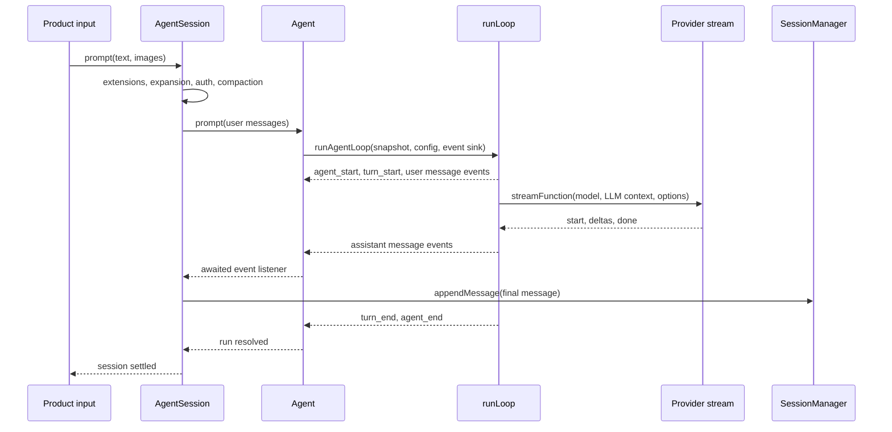

# Pi Implementation Study

## Scope Lock

- **System:** Pi
- **Category:** compact coding-agent runtime and coding-agent product
- **Source tag:** `v0.84.1`
- **Source commit:** `53fa77ccd8a279eb87e92294ef3687b03ff80112`
- **Access date:** 2026-08-07
- **Included surfaces:** `packages/agent`, `packages/coding-agent`, and the
  provider dispatch boundary in `packages/ai`
- **Local runtime:** none installed on `PATH`
- **Current evidence:** exact public source revision with a full local graph
  index

## Current Phase

- **Phase:** 2 — Trace the minimal happy path
- **Status:** `researching`
- **Completed slice:** source trace of one no-tool turn
- **Next question:** How does a tool call extend the loop into validation,
  execution, result persistence, and a follow-up model request?

## Architectural Boundary

Pi separates three layers relevant to a turn:

| Layer | Responsibility | Primary source |
|---|---|---|
| Coding-agent product session | Input interception, skill/template expansion, auth preflight, extensions, persistence, retries, and UI-facing events | `packages/coding-agent/src/core/agent-session.ts` |
| Provider-neutral agent core | Mutable run state, turn loop, stream reduction, tool scheduling, steering, and follow-ups | `packages/agent/src/agent.ts`, `packages/agent/src/agent-loop.ts` |
| Model/provider adapter | Model-to-provider selection, request conversion, authentication application, and provider stream normalization | `packages/ai/src/compat.ts` and `packages/ai/src/api/*` |

The product session does not itself implement the model/tool loop. It prepares
the prompt and delegates to `Agent`, while subscribing to the resulting event
stream for persistence and product behavior.

## Minimal No-Tool Turn

### 1. Product input

`AgentSession.prompt()` accepts text and optional images. Before creating a
user message it can:

- execute an extension command instead of starting a turn;
- let an input extension handle or transform the input;
- expand skill commands and prompt templates;
- queue the input as steering or follow-up when another run is active;
- validate the selected model and provider authentication;
- compact an earlier conversation when required.

For the ordinary path it creates an `AgentMessage` with role `user`, invokes
the `before_agent_start` extension surface, applies any turn-specific system
prompt override, and calls `_runAgentPrompt()`.

**Evidence:** `SOURCE`, `packages/coding-agent/src/core/agent-session.ts`,
`AgentSession.prompt`.

### 2. Agent run creation

`_runAgentPrompt()` marks the product session active and calls
`Agent.prompt()`. `Agent.prompt()` rejects overlapping direct prompts,
normalizes the input, and delegates to `runPromptMessages()`.

`runPromptMessages()` creates a lifecycle-owned abort signal and calls
`runAgentLoop()` with:

- a snapshot of `systemPrompt`, prior `messages`, and `tools`;
- a loop configuration containing the model, context conversion hooks,
  queues, and stop/next-turn callbacks;
- an event sink connected to `Agent.processEvents()`;
- the configured provider stream function.

**Evidence:** `SOURCE`, `AgentSession._runAgentPrompt`, `Agent.prompt`,
`Agent.runPromptMessages`, `Agent.createContextSnapshot`, and
`Agent.createLoopConfig`.

### 3. Turn initialization

`runAgentLoop()` copies the incoming prompt messages into both its return
collection and its private `currentContext`. It then emits:

1. `agent_start`;
2. `turn_start`;
3. `message_start` and `message_end` for each incoming prompt.

It then delegates to `runLoop()`.

**Evidence:** `SOURCE`, `packages/agent/src/agent-loop.ts::runAgentLoop`.

### 4. Context and model request

`streamAssistantResponse()` owns the provider-neutral request boundary:

1. optionally apply `transformContext` to agent messages;
2. call `convertToLlm` to create provider-compatible message values;
3. assemble `{ systemPrompt, messages, tools }` as the LLM context;
4. resolve a fresh API key when a callback is configured;
5. invoke `streamFunction(model, llmContext, options)`.

The coding-agent SDK installs `streamSimple` as the default compatibility
function. That function selects a provider adapter from the model, after which
the adapter builds and streams the provider-specific request.

**Evidence:** `SOURCE`, `streamAssistantResponse`,
`packages/coding-agent/src/core/sdk.ts`, and `packages/ai/src/compat.ts`.

### 5. Stream reduction

On the stream's `start` event, `streamAssistantResponse()` appends the partial
assistant message to the loop context and emits `message_start`. Text,
thinking, and tool-call deltas replace the last partial value and emit
`message_update`. On `done` or `error`, the final result replaces the partial
message and `message_end` is emitted.

This makes the last assistant message in `currentContext.messages` a mutable
stream slot until finalization, rather than appending every delta as a new
conversation message.

**Evidence:** `SOURCE`, `packages/agent/src/agent-loop.ts::streamAssistantResponse`.

### 6. No-tool stop decision

`runLoop()` appends the assistant message to its returned-message collection.
Errors and aborts terminate immediately after `turn_end` and `agent_end`.

For a successful response, the runtime filters assistant content for
`toolCall` blocks. When there are none:

- `hasMoreToolCalls` becomes false;
- `turn_end` is emitted with an empty tool-result list;
- an optional `prepareNextTurn` callback may update context or model settings;
- an optional `shouldStopAfterTurn` callback may force termination;
- the steering queue is polled;
- if no steering or follow-up message exists, both loops exit and `agent_end`
  is emitted.

The ordinary no-tool terminal condition is therefore primarily the absence of
tool calls and queued messages. The loop does not require an explicit
`stopReason === "stop"` branch for this path.

**Evidence:** `SOURCE`, `packages/agent/src/agent-loop.ts::runLoop`.

### 7. State, persistence, and visible completion

`Agent.processEvents()` reduces loop events into mutable in-memory state:

- `message_start` and `message_update` set `streamingMessage`;
- `message_end` clears the streaming slot and appends the finalized message;
- `agent_end` clears any remaining streaming value;
- every event is then delivered to awaited listeners.

`AgentSession` registers its own event listener during construction. On
`message_end`, that listener emits extension and product-facing notifications,
then persists user, assistant, and tool-result messages through
`SessionManager.appendMessage()`. Because listeners are awaited, the agent run
does not settle until this event handling finishes. `_runAgentPrompt()` then
performs post-run handling and emits its final session-settled signal.

**Evidence:** `SOURCE`, `Agent.processEvents`, `AgentSession` constructor,
`AgentSession._handleAgentEvent`, and `AgentSession._runAgentPrompt`.

## Sequence

## State Ownership Finding

Pi uses two related state forms during a run:

- `runLoop` owns a private `currentContext` used for subsequent model calls;
- `Agent` owns product-independent observable state reduced from loop events.

The coding-agent session adds a third, durable layer by persisting finalized
`message_end` events. These are intentionally connected through awaited event
delivery, not by sharing one mutable session object across every layer.

## Evidence and Confidence

| Claim | Label | Confidence | Remaining proof |
|---|---|---:|---|
| The product session delegates the loop to provider-neutral agent core | `SOURCE` | High | Runtime trace not yet captured |
| Context transformation precedes LLM message conversion | `SOURCE` | High | Covered by a repository test, not yet executed locally |
| A no-tool response exits through queue exhaustion | `SOURCE` | High | Add a minimal executable trace |
| Finalized messages are persisted from `message_end` | `SOURCE` | High | Verify the resulting session file in a sanitized run |
| Product notification occurs before the persistence call inside the session listener | `SOURCE` | High | UI consumption timing remains unobserved |

## Next Step

Extend the same path through exactly one tool call:

`toolCall` content → tool lookup → argument preparation and validation →
permission or hook boundary → execution → `toolResult` message → second model
request → final no-tool response.
